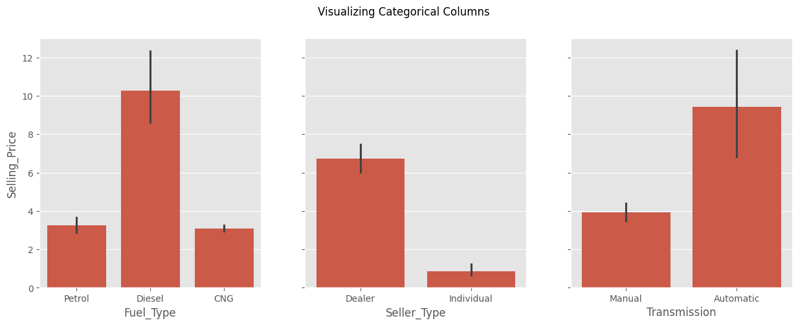
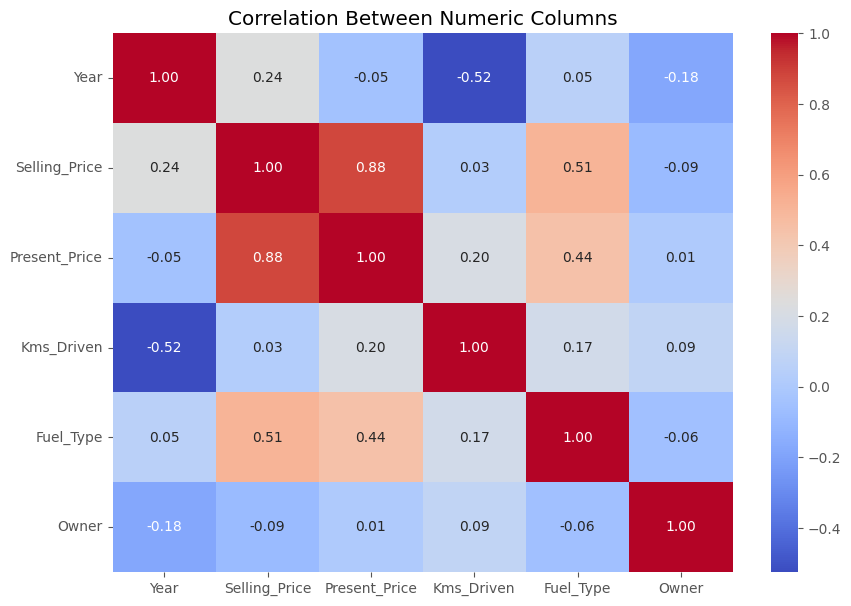
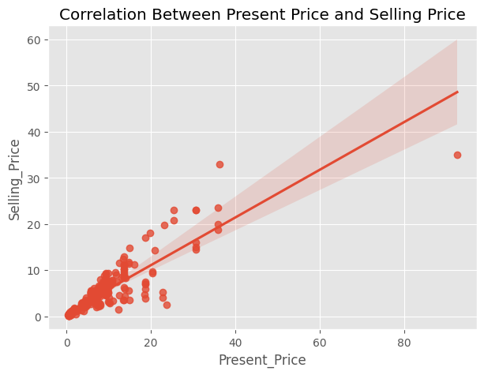
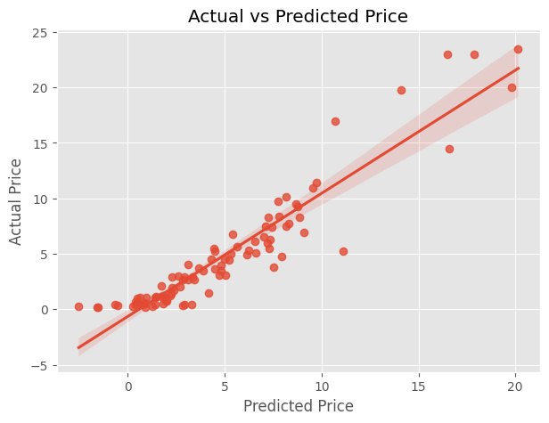

### **Project Overview**
- **Name:** Prabhas Teja Penugonda  
- **Company:** CODTECH IT Solutions  
- **ID:** CT6WDS1908  
- **Domain:** Data Science  
- **Duration:** September to October 2024  
- **Mentor:** Neela Santhosh Kumar  

This project focuses on **predictive modeling using linear regression** to estimate car prices based on various features in the dataset. The goal is to develop a model that accurately predicts the selling price of used cars based on attributes such as fuel type, seller type, transmission, and other numeric values.

---

## **Objective**
The main objective of this project is to:
- Develop a **linear regression model** to predict car prices.
- Understand how different factors influence car prices through data analysis and visualizations.
- Evaluate the performance of the predictive model using appropriate metrics.

---

## **Key Activities**
1. **Data Preparation:**  
   - Cleaning and preprocessing the dataset to handle missing values and categorical variables.
   - Splitting the dataset into training and testing sets for model evaluation.

2. **Predictive Modeling:**  
   - Building a linear regression model to predict car prices based on the selected features.
   - Evaluating model performance using metrics like Mean Absolute Error (MAE), Mean Squared Error (MSE), and R² Score.

3. **Data Visualization:**  
   - Creating visualizations to understand the relationships between features and car prices.

---

## **Visualizations**
The project includes the following visualizations that illustrate key relationships and insights:

1. **Fuel Type, Seller Type, and Transmission vs. Selling Price**  
   - **Description:** This visualization combines the effects of different fuel types, seller types, and transmission types on the selling price of cars, providing a comprehensive view of how these factors influence pricing.
   
   

4. **Correlation Between Numeric Columns:**
   - A heatmap displaying correlations between numeric features in the dataset.
   

5. **Correlation Between Selling Price and Present Price:**
   - A scatter plot showing the relationship between actual selling prices and present prices.
   

6. **Actual Price vs. Predicted Price:**
   - A comparison plot illustrating the accuracy of the model predictions against actual selling prices.
   

---

## **Technologies Used**
- **Python:** Primary language for data analysis and modeling.
- **pandas:** For data manipulation and preprocessing.
- **matplotlib:** For generating static and interactive visualizations.
- **seaborn:** To create appealing statistical graphics.
- **scikit-learn:** For building and evaluating the linear regression model.

---

## **How to Run the Project**

1. **Clone the Repository:**
   ```bash
   git clone <https://github.com/prabhasteja007/CODTECH-Task2>
   cd your-repository-name
